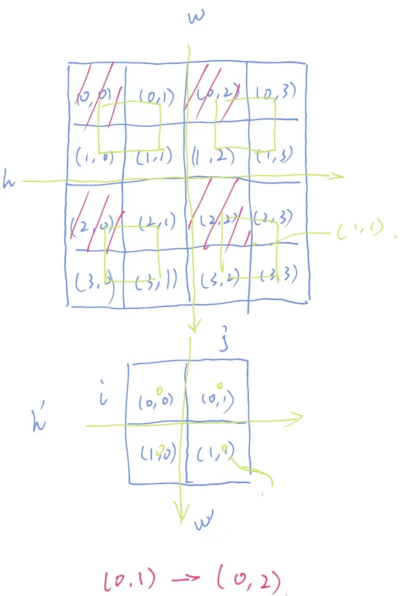

# 数字图像处理报告

61520216 石杰

## 功能实现

### 双线性插值

首先, 在上次实验的基础上, 我先实现了得到坐标为$(i,j)$位置像素的指针的函数

```cpp
Byte* MyImage::get_p(int x, int y){
    assert(x >= 0 && y >= 0 && x < height() && y < width());
    Byte* pImageBytes = bits();//图像数据首地址
    int lineBytes = this->bytesPerLine();   //每行字节数
    return pImageBytes + x * lineBytes + y * (this->depth()/8); //注意不同位深偏移字节数不同
}
```

接下来, 假设变换后图像某一像素对应到原像素后坐标为$(x,y)$,对应的灰度值为$g$, 离其最近的四个像素的的坐标分别为$(x_1, y_1),\ (x_1, y_2),\ (x_2, y_1),\ (x_2, y_2)$, 对应像素的灰度值为$g_1$~$g4$, 设$(x_1,y)$和$(x_2, y)$处的灰度值分别为$g_{t1}$和$g_{t2}$, 则可以得到双线性插值的公式为
$$
g_{t1} = \frac{g_2 - g_1}{y_2 - y_1}(y-y_1)+g_1\\
g_{t2} = \frac{g_4 - g_3}{y_2 - y_1}(y-y_1)+g_3\\
g = \frac{g_{t2} - g_{t1}}{x_2 - x_1}(x-x_1)+g_{t1}
$$


根据以上公式实现双线性插值算法如下

```cpp
Byte MyImage::bi_interpol(int x1, int y1, int x2, int y2, double x, double y, int d){
    Byte g1 = get_p(x1, y1)[d];
    Byte g2 = get_p(x1, y2)[d];
    Byte g3 = get_p(x2, y1)[d];
    Byte g4 = get_p(x2, y2)[d];
    double gt1, gt2;
    Byte g;
    if(y2 == y1)
        gt1 = g1; gt2 = g3;
    else{
        gt1 = g1 + double((g2 - g1))/(y2 - y1)*(y - y1);
        gt2 = g3 + double((g4 - g3))/(y2 - y1)*(y - y1);
    }
    if(x1 == x2)
        g = static_cast<Byte>(gt1);
    else
        g = static_cast<Byte>(gt1 + (gt2 - gt1)/(x2 - x1)*(x - x1));
    return g;
}
```

其中考虑了`y2 == y1, x2 == x1`的特殊情况, 同时, 为了实现对RGB格式或ARGB图像格式的线性插值, 函数增加了一个输入参数`d`, 用来表示这是对改图像的第几个通道进行插值, 最后返回目标点灰度值或通道值对应的字节.

### 缩放

目前只实现了图像的等比缩放, 但其实长宽比改变的缩放也很好实现. 

进行缩放前, 首先计算了放大后图像的大小, 并根据原图像的格式初始化了目标图像的格式

```cpp
int destW = static_cast<int>(scale * w);
int destH = static_cast<int>(scale * h); // 放大后图像的长宽映射到最近的整数
QImage::Format f = this->format();
MyImage destImage(destW, destH, f);
```

之后进行图像的缩放操作, 这里同样需要进行坐标变换, 将坐标变换到图像中心, 否则可能会出现采样点像左上角偏移的情况.

如下图所示, 上面是缩放前的图像(坐标为$x, y$), 下面是缩放后的图像(坐标为$i, j$) 如果不进行坐标系变换, 而直接将缩放后图像像素位置×2, 会对应到原图像红色位置上, 而我们实际想要的采样是绿色方框所示的位置. 同时, 原本像素的坐标是由其左上角坐标表示, 为了恰当表示缩放关系, 我们应该用像素中心的坐标表示像素的位置.



综上, 我们可以得到变换后图像各像素对应到原图像的公式, 以$i\rightarrow x$为例
$$
\begin{aligned}
i' &= i - \frac{w'}{2} +0.5\\
x' &= i'\cdot \frac{w}{w'}\\
x &= x' -0.5+\frac{w}{2}
\end{aligned}
$$
联立化简得
$$
x = (i+0.5)\cdot\frac{w}{w'}-0.5
$$
在该次实验代码中, $w/w'$和$h/h'$大小均为`1/scale`, 总的代码如下

```cpp
    for(int i = 0; i < destH; i++){
        for(int j = 0; j < destW; j++){
            //找到目标图像对应源图像中的位置
            double x = (i + 0.5) / scale - 0.5;
            double y = (j + 0.5) / scale - 0.5;
            //找到对应的四个最近的点
            int x1 = max(static_cast<int>(floor(x)), 0); //防止过界
            int y1 = max(static_cast<int>(floor(y)), 0);
            int x2 = min(x1 + 1, h-1);
            int y2 = min(y1 + 1, w-1);
            // 对不同位深(如ARGB)运用双线性插值
            for (int k = 0; k < this->depth()/8; k++)
                destImage.get_p(i,j)[k] = this->bi_interpol(x1, y1, x2, y2, x, y, k);
        }
    }
```

### 旋转

旋转分为两种情况, 一是不进行裁剪, 通过扩大"画布"区域来显示全部图像, 二是将旋转后图像裁剪到原图同样大小的区域中. 前一种中旋转中心的选取不会改变输出图像的结果.

与缩放相似, 我们首先需要计算旋转后图像的大小, 情况二大小不变, 而情况一大小计算公式如下($\alpha$为旋转角度, 以顺时针为证)
$$
w' = w\cos(|\alpha|)+h\sin(|\alpha|)\\
h' = w\sin(|\alpha|)+h\cos(|\alpha|)
$$
同样, 两种情况都需要进行坐标系变换, 情况一将坐标系移动到图像中心, 然后同样需要±0.5, 以便用像素中心坐标表示像素. 情况二则是将坐标系移动到旋转中心$(x0,y0)$

参考教科书, 图像旋转的矩阵表示为(以逆时针为正方形)
$$
 \begin{bmatrix}
i \\
 j\\
1
\end{bmatrix}=
\left[\begin{array}{ccc}
\cos \alpha & -\sin \alpha & 0 \\
\sin \alpha & \cos \alpha & 0 \\
0 & 0 & 1
\end{array}\right]
\begin{bmatrix}
 x\\
 y\\
1
\end{bmatrix}
$$
那对应的由旋转后图像像素位置对应到原图像素位置的矩阵表示为
$$
 \begin{bmatrix}
x \\
y\\
1
\end{bmatrix}=
\left[\begin{array}{ccc}
\cos \alpha & \sin \alpha & 0 \\
-\sin \alpha & \cos \alpha & 0 \\
0 & 0 & 1
\end{array}\right]
\begin{bmatrix}
i\\
j\\
1
\end{bmatrix}
$$
综上, 旋转的代码为

```cpp
MyImage destImage(w, h, f);
        for(int i = 0; i < h; i++){
            for(int j = 0; j < w; j++){
                double ii = i - x0 + 0.5;
                double jj = j - y0 + 0.5;	// 移动坐标系
                double xx = ii * cos(alpha) + jj * sin(alpha);
                double yy = -ii * sin(alpha) + jj * cos(alpha);
                double x = xx - 0.5 + x0;
                double y = yy - 0.5 + y0;
                if (x < 0 || x >= h || y < 0 || y >= w){
                    for (int k = 0; k < d/8; k++)
                        destImage.get_p(i,j)[k] = 0; //对于空余部分用0填充
                }
                else{
                    int x1 = max(static_cast<int>(floor(x)), 0);
                    int y1 = max(static_cast<int>(floor(y)), 0);
                    int x2 = min(x1 + 1, h-1);
                    int y2 = min(y1 + 1, w-1);
                    // 对不同位深数值(如ARGB)运用双线性插值
                    for (int k = 0; k < d/8; k++)
                        destImage.get_p(i,j)[k] = this->bi_interpol(x1, y1, x2, y2, x, y, k);
                }
            }
        }
```

### 图像显示

由于在上一次实验中, 我已经实现了图像在显示窗格内的缩放(没有改变原图像大小, 只是改变了绑定的Widget的大小, 从而在View中显示不同数量 的像素), 因此此处我并未做太大改动. 

唯一的问题是, 我已经设定好显示图像时先缩放到View能显示全部图像, 因此放大图片的效果可能不太明显, 所以我在图像显示区域下方添加了图像的高宽信息, 从另一方面展示放大效果.

## 实验结果

### 图像缩放

图像放大五倍的效果


总体效果


局部细节对比


图像缩小到原有的1/5(整体)


局部细节


对彩色图片可以进行同样的操作


### 旋转

旋转时可以选择旋转度数, 并选择是否裁剪到原图像大小


旋转30度


以左上角为中心旋转, 并裁切到原本大小


对有alpha通道的图片, 空出来的区域则由透明效果填充, 同时, 旋转角度可以选为负值, 这会朝顺时针方向旋转


细节对比


## 思考总结

在本次实验中, 我自行推导并编写了双线性插值和旋转缩放的原理并成功地实现了他们, 从放大图像的结果来看, 双线性插值能缓解马赛克效应, 实现较好的变换效果, 但对于图像缩小的情况, 效果确并不是十分明显. 而在旋转操作中, 双线性插值能维持基本都边缘, 但仍会有一些模糊的现象, 而且边缘会出现锯齿形

同时还可以发现, 图像变换本质上就是坐标轴的变换, 并且理论上说所有的基本变换应该都可以统一用矩阵表示, 这体现了基本坐标变换的一致性.


## 问题及后续改进

- 在实验过程中, 我发现Qt中`QImage`类读取24位RGB图片时所设置的位深始终是32位


这或许是因为其读取图像时将格式识别为了RGB24, 但仍用4字节存储, 只是对应透明度的都填成了`ff`.

- 当前图像伸缩长宽比未改变, 但可以设置为不同的放大倍数
- 放大后图像直接全部显示, 呈现效果不佳
- 人机交互以输入参数和角度进行, 后续可以试着添加鼠标旋转旋转中心并控制旋转方向和角度
- 后续可以加入多种插值方式的比较
- 可以尝试实现用矩阵统一所有变换形式.