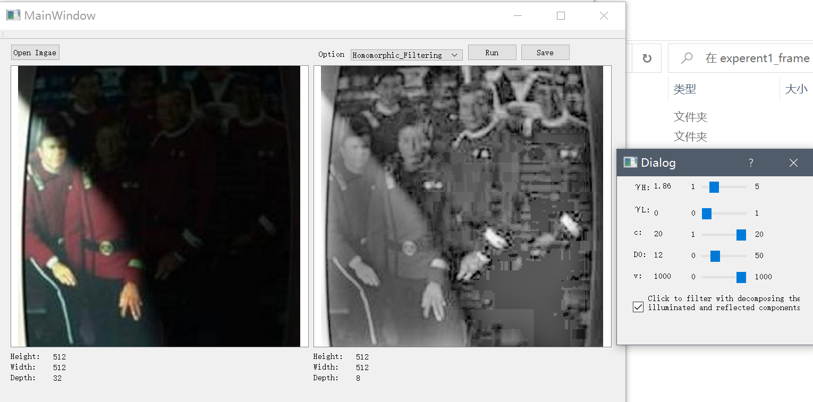
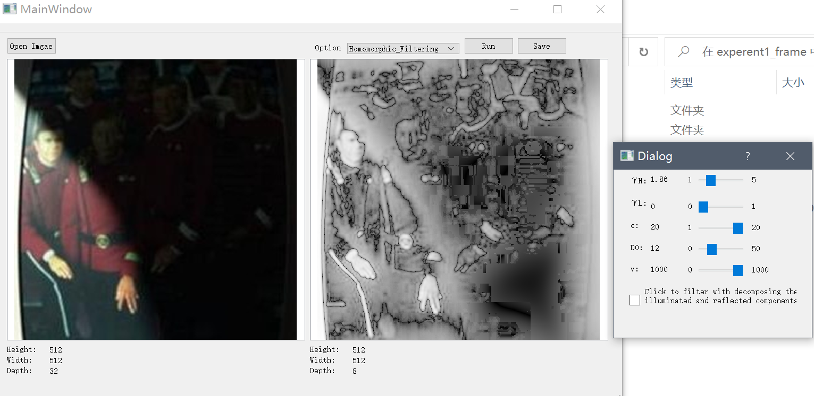
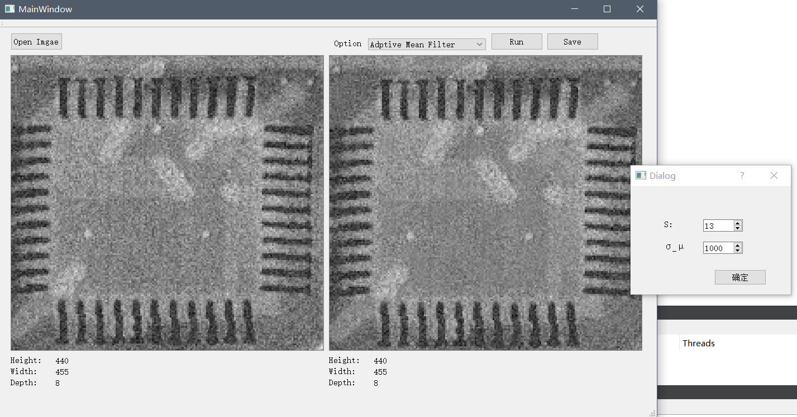

# 实验报告

61520216

## 同态滤波

### 代码及实现

为了实现同态滤波, 我主要在前面实验的基础上编写了高斯高通滤波器GHPF, 为了GHPF可以用于同态滤波器, 我额外增加了A, c, C等几个参数

```cpp
void MyImage::GHPF(double D0, double c, double A, double C)
{	//H(u,v) = A[1-exp(-c*D^2(u,v)/(2*D0^2))]+C
    //D(u,v) = √((u-P/2)^2+(v-Q/2)^2)
    for(int u = 0; u < m_dataHeight;u++){
        for(int v = 0; v < m_dataWidth;v++){
            complex<double> D = sqrt((u-m_dataHeight*0.5)*(u-m_dataHeight*0.5)+(v-m_dataWidth*0.5)*(v-m_dataWidth*0.5));
            complex<double> p = -c*D*D*0.5*(1/D0)*(1/D0);
            complex<double> H = A*(1.0-exp(p))+C;
            data[u * m_dataWidth + v] = H * data[u * m_dataWidth + v];
        }
    }
}
```

最后同态滤波器实现如下

```cpp
MyImage MyImage::homomorphic_filtering(double gamma_H, double gamma_L, double c, double D0, double v)
{
    readImageData();
    for(int u = 0; u < m_dataHeight;u++){
        for(int v = 0; v < m_dataWidth;v++){
            if(0.0 == data[u * m_dataWidth + v]) data[u * m_dataWidth + v] += 1e-10;//防止出现求零的对数的情况
            data[u * m_dataWidth + v] = log(data[u * m_dataWidth + v]);
        }
    }
    DFT();
    GHPF(D0,c,(gamma_H-gamma_L),gamma_L);
    iDFT();
    for(int u = 0; u < m_dataHeight;u++){
        for(int v = 0; v < m_dataWidth;v++){
            data[u * m_dataWidth + v] = exp(data[u * m_dataWidth + v]);
        }
    }
    return writeImage(v);
}
```

同样还有一个函数`GHPF_hf`, 为上面的函数去掉求对数和指数部分, 即没有分解照射分量和反射分量.

### 实验结果

最后的实验结果如下, 在分解照射分量和反射分量后, 可以看到阴影中的人物可以看清楚了. (部分损失是图像本身的问题)



如果取消勾选分解光照和反射分量后, 我们可以看到, 结果只是使得图像边缘更明显了. 效果并不好.



### 结果分析与思考

从结果可以看出, 光照分量和反射分量是必须要分离的, 这样, 高通滤波器就会抑制频率较低的光照分量, 这样可以减少光照对图像质量的影响, 并且加强频率较高的反射分量, 使图像本身更加清晰(反射分量相当于图像本身的纹理). 

同时, 从具体实现的角度, 对图像求对数相当于减小图像总体灰度梯度, 也就相当于减小高频分量, 即一个频域低通滤波器. 这样再使用高通滤波器就可以防止对图像高频分量的过度加强, 提高总体表现效果.

如果只使用高通滤波, 那结果只是加强边缘(锐化)

## 自适应滤波器

根据自适应均值滤波器的原理实现了`adp_mean_filter`函数, 其中主要部分是计算均值和方差, 当噪声方差大于局部方差时, 将噪声方差设为局部方差, 使二者的比值小于1

```cpp
...
MyImage destImage(w, h, f);
    for(int i = 0; i<h;i++){
        for(int j = 0; j < w;j++){
            double mean = 0;
            double localVar = 0;
            int count = 0;
            for(int ii = i-S/2; ii <= i+S/2; ii++){
                for(int jj = j-S/2; jj <= j+S/2; jj++){
                    if(ii < 0 || ii >= h || jj < 0 ||jj>=w){
                        count ++;
                        continue;
                    }
                    double g_s = *get_p(ii,jj);
                    mean += g_s;
                    localVar += g_s*g_s;
                }
            }
            int S2 = S*S-count;
            mean = mean/S2;
            localVar = localVar/S2 - mean*mean;

            if(noiseVar > localVar)
                noiseVar = static_cast<int>(floor(localVar)); //防止出现noiseVar > localVar
            Byte g = *get_p(i,j);
            *destImage.get_p(i,j) = g - static_cast<Byte>(noiseVar*noiseVar/localVar/localVar*(g - mean));
        }
    }
...
```

最后结果如下



可见, 自适应均值滤波可以一定程度上消除噪声, 但效果并不是特别好, 同时, 它能保证边缘基本不发生改变.

